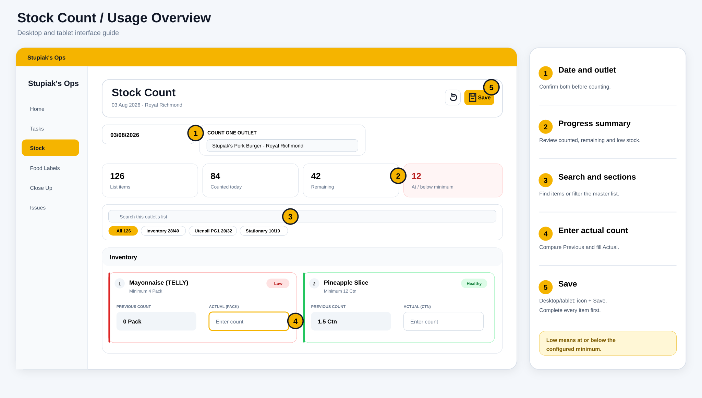
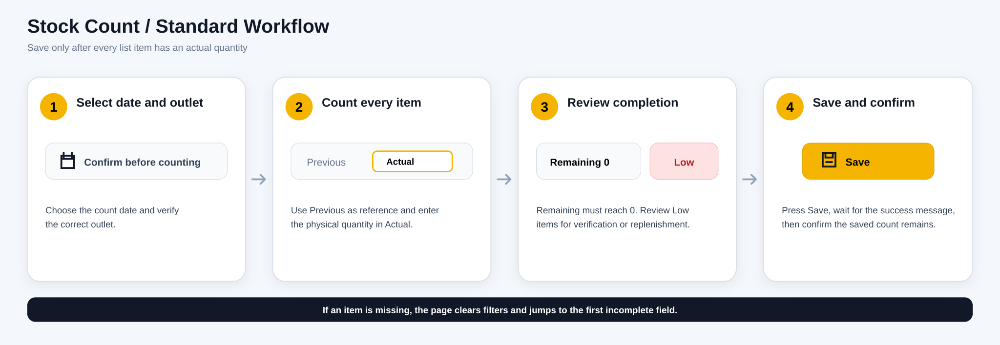

# Stock Count 使用指南 / User Guide

## 中文说明

### 页面用途

Stock Count 用于指定日期、指定门店的完整库存盘点。页面会读取门店的 Master Stock List，并显示上一次已保存数量、最低数量、目标数量和当前状态。员工填写本次实际数量后，使用右上角 **Save** 保存。

### 界面区域

1. **日期与门店**
   - 日期决定本次盘点属于哪一天。
   - 多门店账号会显示门店选择器；单门店账号只显示已分配门店。
   - 开始前必须确认日期和门店正确。

2. **进度摘要**
   - **List items**：该门店需要盘点的总项目数。
   - **Counted today**：所选日期已经有实际数量的项目数。
   - **Remaining**：仍未填写的项目数。
   - **At / below minimum**：实际数量处于或低于最低数量的项目数。

3. **搜索与分类**
   - 搜索框可按物品名称、类别或 Section 搜索。
   - 分类按钮可切换 `Inventory`、`Untensil PG1`、`Utensil PG2`、`Stationary` 等 Section。
   - 分类按钮右侧的 `已盘点/总数` 可快速查看该分类完成度。

4. **库存项目卡**
   - **Previous count**：所选日期之前最近一次保存的实际数量。
   - **Actual**：本次现场盘点数量，支持整数和小数，不接受负数。
   - **Minimum**：最低库存数量。
   - **Target**：目标库存数量（有设定时才显示）。
   - 如果采购单位和盘点单位不同，页面会显示换算关系。

5. **刷新与保存**
   - 刷新按钮重新读取当前日期、门店和库存项目。
   - 桌面和平板显示 **保存图标 + Save**；手机保留紧凑图标按钮。
   - 保存前，所有项目都必须填写。若有遗漏，页面会清除搜索/分类过滤、跳到第一个未填写项目并高亮输入框。
   - 保存成功后，页面重新读取服务器数据并显示成功信息。

### 标准操作流程

1. 选择盘点日期，并确认门店。
2. 从第一项开始，对照 **Previous count**，在 **Actual** 输入现场实际数量。
3. 使用搜索或 Section 分类快速定位物品。
4. 确认 **Remaining = 0**。
5. 检查红色 **Low** 项目是否需要补货或进一步确认。
6. 按右上角 **Save**。
7. 等待成功信息；页面重新读取后，已保存数量会保留。

### 状态说明

| 状态 | 说明 |
| --- | --- |
| **Low** | 实际数量小于或等于最低数量。 |
| **Below target** | 实际数量高于最低数量，但低于目标数量。 |
| **Healthy** | 实际数量达到健康范围。 |
| **No minimum** | 该项目没有设定最低数量。 |
| **Not counted** | 所选日期尚未填写实际数量，也没有可使用的数量。 |

### 使用注意

- 切换日期或门店时，页面会重新读取对应数据。
- 页面只保存有变更的项目，但为了确保整张盘点表完整，保存前仍要求所有项目都已填写。
- 若所有项目已经保存且没有新变更，再按 Save 会提示该日期的库存项目已全部保存。
- 红色 **Low** 是库存提示，不等于保存失败。
- 若物品名称、最低数量、目标数量或 Section 不正确，应由管理人员修正 Master Stock List，而不是在盘点页面修改。

---

## English Guide

### Purpose

Stock Count is used to complete a full inventory count for one outlet and one date. The page loads the outlet’s Master Stock List and shows the previous saved quantity, minimum quantity, target quantity and current stock status. Staff enter the physical quantity in **Actual**, then use **Save** in the upper-right corner.

### Screen areas

1. **Date and outlet**
   - The date determines which day the count belongs to.
   - Accounts assigned to multiple outlets see an outlet selector; single-outlet accounts see the assigned outlet.
   - Confirm both before starting.

2. **Progress summary**
   - **List items**: total items that must be counted.
   - **Counted today**: items with an actual quantity for the selected date.
   - **Remaining**: items still missing an actual quantity.
   - **At / below minimum**: items whose quantity is at or below the configured minimum.

3. **Search and sections**
   - Search by item name, category or section.
   - Section chips filter `Inventory`, `Untensil PG1`, `Utensil PG2`, `Stationary` and other configured sections.
   - Each section chip shows `counted/total` progress.

4. **Stock item card**
   - **Previous count**: the latest saved actual quantity before the selected date.
   - **Actual**: the physical quantity for this count; whole numbers and decimals are accepted, negative values are not.
   - **Minimum**: minimum stock quantity.
   - **Target**: target quantity when configured.
   - A conversion note appears when the purchase unit differs from the count unit.

5. **Refresh and Save**
   - Refresh reloads the current date, outlet and stock list.
   - Desktop and tablet show **Save icon + Save**; mobile keeps the compact icon button.
   - Every item must be completed before saving. If an item is missing, the page clears search/section filters, jumps to the first incomplete item and highlights its input.
   - After a successful save, the page reloads server data and shows a confirmation message.

### Standard workflow

1. Select the count date and confirm the outlet.
2. Work through every item. Compare **Previous count** and enter the physical quantity in **Actual**.
3. Use search or section filters to locate items quickly.
4. Confirm that **Remaining = 0**.
5. Review red **Low** items for replenishment or verification.
6. Press **Save**.
7. Wait for the success message and confirm the saved quantities remain after the page reloads.

### Status reference

| Status | Meaning |
| --- | --- |
| **Low** | Actual quantity is less than or equal to the minimum. |
| **Below target** | Actual quantity is above the minimum but below the target. |
| **Healthy** | Actual quantity is within the healthy range. |
| **No minimum** | No minimum quantity is configured. |
| **Not counted** | No actual quantity is available for the selected date. |

### Notes

- Changing the date or outlet reloads the matching data.
- Only changed items are submitted, but the full list must be completed before Save is allowed.
- Pressing Save with no new changes shows that all items are already saved for that date.
- A red **Low** status is a stock warning, not a save error.
- Incorrect item names, minimums, targets or sections should be corrected in the Master Stock List by management, not on the count screen.
